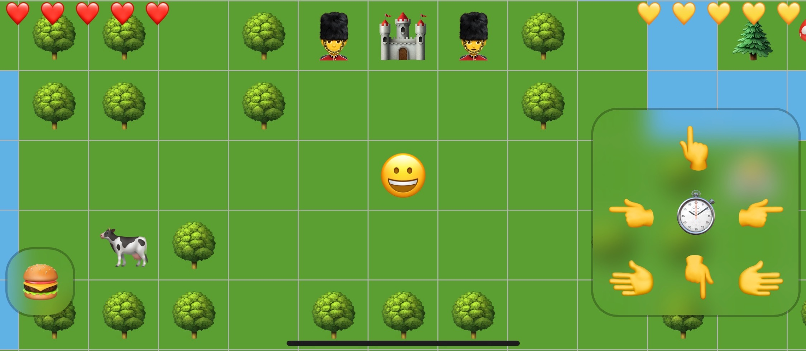

# 🧙‍♀️ Emoji Quest 🧝‍♂️

<nobr>🌈 <b>Mojick</b></nobr> has faded from the world.
<nobr>🐉 <b>Mojical creatures</b> 🦄</nobr> have been lost for an <nobr>age 🕰</nobr>.
You, <nobr>😬 <b>Adventurer</b> 😲</nobr>, are charged to wander the
<nobr>🎲 <b>Faces of Daia</b> 🎲</nobr> to find and restore the
<nobr><b>💨 essences 💦 of 🔥 mojick ⚡️</b></nobr>,
<nobr>❓ interrogating</nobr>,
<nobr>🪓 harvesting</nobr>,
<nobr>✂️ crafting</nobr>, and,
where the cause is just,
<nobr>⚔️ fighting</nobr>
<b>emojis</b> to restore mojick to all the lands.

Emoji Quest is in development and brought to you by the makers of [Escape
Peruácru Island][peruacru], [BØRK: Escape the Scandinavian Home Furnishings
Labyrinth][bork], a [weird color picker][color], an [Elvish][elvish]
transcriber, an Elvish interactive [Map of Middle-Earth][elfmap], and some
[influential][q] JavaScript [stuff][commonjs].[^puns]

* 🕷 [Web Home][web]
* 🧸 [Play][web]
* 🎮 [Discord][discord]
* 📈 [Spreadsheets][spreadsheets]
* 🧛‍♂️ [Patreon][patreon]

By way of historical note, we [previously attempted to build <nobr>Emoji
Quest</nobr>][lobsterquest] in a graphics programming language called
[Lobster][lobster].

[^puns]: ⚠️&nbsp;May contain puns&nbsp;⚠️.

[peruacru]: https://peruacru.then.land
[bork]: http://børk.com
[color]: http://color.codi.sh
[elvish]: https://tengwar.3rin.gs
[elfmap]: http://3rin.gs
[q]: https://www.npmjs.com/package/q
[commonjs]: http://wiki.commonjs.org/wiki/Modules/1.1
[lobsterquest]: https://github.com/borkshop/lobsterquest
[lobster]: http://strlen.com/lobster/

[discord]: https://discordapp.com/channels/692076552514699426/692076553017884723
[spreadsheets]: https://docs.google.com/spreadsheets/d/1U8JJM-g7Br0ePrjH7kg7tJ3N2eb0Mab2y5GDiJo1Tx8/edit#gid=97282066
[web]: https://github.com/borkshop/emojiquest.app
[patreon]: https://www.patreon.com/kriskowal
